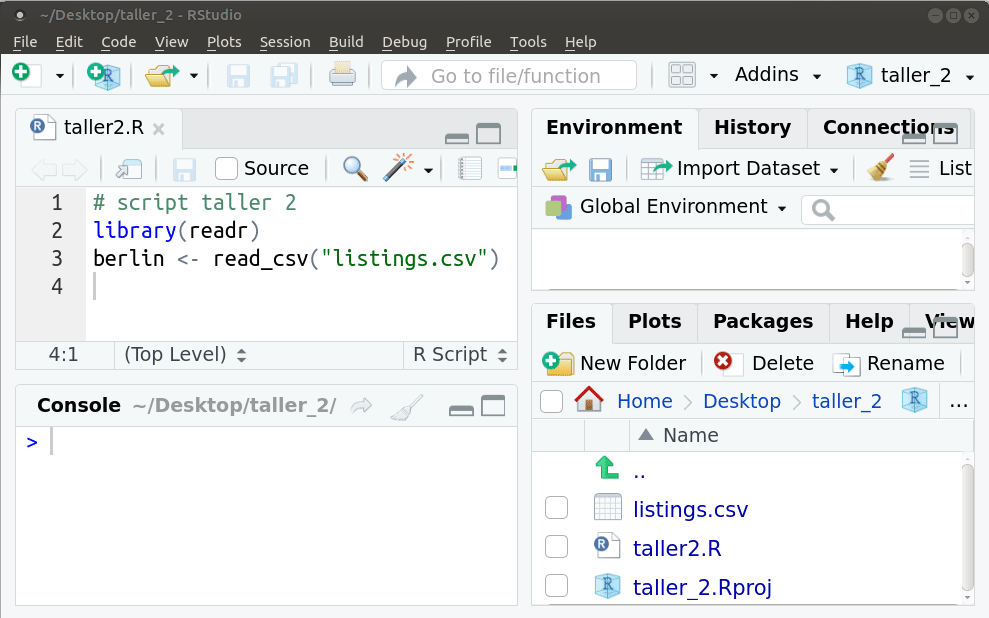
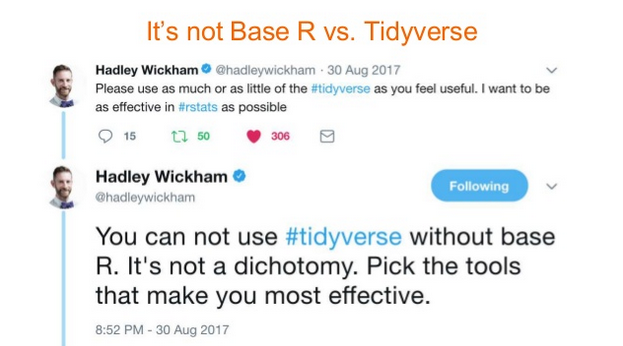

```{r, include = F}
knitr::opts_chunk$set(fig.width = 6, message = FALSE, warning = FALSE, comment = "", cache = FALSE, fig.retina = 3)
library(flipbookr)
library(tidyverse)
library(flair)
library(kableExtra)
```
```{r xaringan-themer, include=FALSE, warning=FALSE}
library(xaringanthemer)
style_duo_accent(
  #base_color = "#43a2ca",
  header_font_google = google_font("Mukta"),#Ubuntu Condensed
  text_font_google   = google_font("Montserrat", "300", "300i"),
  code_font_google   = google_font("Fira Mono"),
  primary_color      = "#0F4C81", # pantone classic blue
  secondary_color    = "#b3e2cd", # pantone baby blue
  #header_font_google = google_font("Raleway"),
  #text_font_google   = google_font("Raleway", "300", "300i"),
  #code_font_google   = google_font("Source Code Pro"),
  text_font_size     = "25px"
#   colors = c(
#   red = "#f34213",
#   purple = "#3e2f5b",
#   orange = "#ff8811",
#   green = "#136f63",
#   white = "#FFFFFF",
# )
)

```

```{r, include=FALSE}
text_spec2 <- function(x = "x"){
  text_spec(x, background = "#b3e2cd", bold = T)
}
```

# ¿Qué haremos hoy?

- Repaso del primer taller 
<br>
--

- Trabajar en proyecto (.Rproj)
<br>
--

- Definir una función para encontrar un dato faltante
<br>
--

- Definir una función para encontrar un caso duplicado
<br>
--

- Introducción al paquete dplyr para profundizar en el análisis de los datos de Barcelona
<br>
--

- Operadores lógicos y de comparación
<br>
--

- Encadenar funciones: operador %>%
<br>
--

- Exportar objetos a archivos Rdata. Importar archivos Rdata.
<br>
--

- Buenas prácticas a la hora de escribir código

---
# Trabajar en proyecto

.pull-left[

Permite ordenar los diferentes archivos de un análisis y prescindir de usar setwd() y/o escribir rutas larguísimas. 

Si el archivo `tesis.Rproj` está ubicado en: `/home/calcita/Escritorio/tesis`, todos los archivos que estén en la carpeta tesis voy a poder cargarlos sin definir una ruta del archivo. 

```{r eval=FALSE}
df <- read_csv("datos.csv")
```

]

.pull-right[
```{r echo = FALSE}
knitr::include_graphics("img/fd1.png")
```

]

---
# Crear proyecto
```{r, out.height="10%", echo =FALSE}
knitr::include_graphics("img/create_project.gif")
```

<!--  -->

---
# Cargar proyecto


---
# Importar archivos de un proyecto


<!-- --- -->
<!-- # Estructura de un proyecto  -->

<!-- Una buena práctica es estructurar dichos archivos con cierta lógica que permita a otra persona entender qué es cada cosa y a la propia persona que lo hizo en un futuro.  -->


---
# Importo los datos de Barcelona

Es una nueva sesión así que no tengo los objetos en memoria que tenía ayer.

Voy a usar la función `read_csv` del paquete `readr`. Hay dos maneras de hacerlo:

```{r}
library(readr) # cargo el paquete
listado <- read_csv("data/listings.csv") #importo los datos
```
O en una sola línea

```{r}
#importo los datos indicando de que paquete es la función
listado <- readr::read_csv("data/listings.csv") 
```
En esta segunda opción no queda cargado el paquete, pero como solo voy a usarlo en esta línea no me importa.

---
# Datos faltantes (NA)

- La función `r text_spec2("is.na()")` chequea si hay un dato faltante (`r text_spec2("NA: not available")`) para cada elemento de un vector. 
<br><br>
--


```{r}
x <- c(-22, 4, -1, 8, NA) #<<
x
```
- ¿Cuántos datos faltantes tiene x?
--

- Devuelve un `r text_spec2("vector lógico")`, donde el TRUE indica que no hay dato y el FALSE que sí hay dato.

```{r}
is.na(x) #<<
```
---
# Ejemplo: Datos faltantes (NA)

```{r echo = FALSE}
library(readr)
listado <- read_csv("data/listings.csv")
```

```{r}
faltantes <- is.na(listado$price)
head(faltantes) # me muestra los primeros 6 valores/casos
```
--

- ¿Cuántos son los valores faltantes de  `price`?

```{r}
sum(faltantes) #<<
```

El valor lógico `r text_spec2("TRUE")` representa al `r text_spec2("1")` y el valor `r text_spec2("FALSE")` representa al `r text_spec2("0")` por eso puedo usar la función `r text_spec2("sum()")`. 

---
# Observaciones duplicadas

La función `r text_spec2("duplicated()")` determina cuales elementos de un vector o data frame están duplicados, devuelve un vector lógico: TRUE si es duplicado y FALSE en caso contrario.
<br><br>
--

- `r text_spec2("Compara un elemento del vector con todos los anteriores")`, va asignando el valor FALSE hasta que se encuentra con un caso duplicado y en este caso le asigna TRUE y sigue comparando. 


```{r}
x <- c(-22, 4, 8, 8, NA) #<<
x
```
--
```{r}
duplicated(x) #<<
```

---
# Ejemplo: observaciones duplicadas


- Chequeo que haya algún `r text_spec2("caso duplicado")`, reviso todas las variables
```{r}
repetidos <- duplicated(listado) # el argumento es el data frame #<<
sum(repetidos) # los sumo, recordar: TRUE es 1 y FALSE es 0 #<<
```

- Chequeo que haya algún `r text_spec2("valor duplicado")`  en la `r text_spec2("variable identificatoria de cada caso")`

```{r}
repetidos <- duplicated(listado$host_id) # el argumento es una variable #<<
sum(repetidos) #<<
```

Si nombro a un objeto igual a uno existente, lo sobreescribo.

---
class: inverse, center, middle
# dplyr

---
# Manipular datos con dplyr
```{r setup, include = FALSE}
options(htmltools.dir.version = FALSE)
knitr::opts_chunk$set(warning = FALSE, message = FALSE)
library(readr) # load tidyverse package
library(dplyr)
#library(leaflet) # uncomment to use if you install
listado <- read_csv("data/listings.csv")
```

- El paquete dplyr permite representar la información de un `r text_spec2("data frame")` en forma de `r text_spec2("tabla")`, donde cada fila representa una observación y cada columna represente una variable.
<br><br>
--

- dplyr no provee ninguna funcionalidad que no pueda ser realizada con las funciones del paquete base, sin embargo, es más simple y rápido (está escrito en C++).
<br><br>
--

- Todas las funciones del paquete tiene la particularidad de que su  `r text_spec2("primer argumento es un data frame")` al que le realizará la operación, mientras que los subsiguiente argumentos describen como realizar tal operación. 

- Finalmente el `r text_spec2("resultado")` de todas estas funciones es un nuevo `r text_spec2("data frame")`. Esto no ocurre con las funciones de base. 

---
class: center, middle
# ~~Base R vs. Tidyverse~~


---
# Instalar y cargar dplyr

- La instalación es por única vez en una computadora. 
```{r eval=FALSE}
# install.packages("dplyr") # ya lo tengo instalado
```
- Comenté esa línea porque ya lo tengo instalado
--

- En cada nueva sesión de RStudio lo debo cargar para poder usar sus funciones

```{r}
library(dplyr) #<<
```

 Notar que en la función de instalación el nombre del paquete se escribe entre comillas pero en la función de carga va sin comillas. No hagas ~~library("dplyr")~~.


---
# Manipular datos

- Seleccionar columnas/variables
<br><br>
--

- Cambiar nombre de variables
<br><br>
--

- Transformar variables
<br><br>
--

- Crear nuevas variables
<br><br>
--

- Filtrar o eliminar observaciones
<br><br>
--

- Chequear existencia de observaciones duplicadas
<br><br>
--

- Chequear existencia de datos faltantes
<br><br>
--

- Reestructurar los datos

---
class: inverse, center, middle
# dplyr::select()

---
# Seleccionar columnas/variables 

- La función `r text_spec2("select()")`  selecciona columnas de un data frame
--

- El primer argumento es el data frame y luego la(s) variable(s) separadas por coma.
--

- `select`(`r text_spec2("<dataframe>")`, `r text_spec2("<variable>")`) 
--

.pull-left[
```{r}
select(listado, host_name) #<<
```
]
.pull-rigth[

```{r}
select(listado, host_id, host_name) #<<
```
]

 Las funciones de tidyverse permiten llamar a las variables de un data frame sin usar comillas pero esto no es aplicable al resto de los paquetes de R, incluido los del base.

---
# Seleccionar columnas/variables 

.pull-left[
Seleccionar un rango de columnas: select(`r text_spec2("<df>")`, `r text_spec2("<desde>:<hasta>")`)

```{r eval = TRUE}
select(listado, price:number_of_reviews)
```

]
.pull-right[
Seleccionar todas las columnas menos una: select(`r text_spec2("<df>")`, `r text_spec2("-<variable>")`)


```{r eval = TRUE}
select(listado, -host_name)
```

]

---
class: inverse, center, middle
# dplyr::slice()

---
# Seleccionar filas/observaciones por su posición

- La función `r text_spec2("slice()")` selecciona observaciones/filas según su posición. 
--

- Esto no es robusto a un reordenamiento de las observaciones. Sirve para "ver" algunos casos.
--

- `slice`(`r text_spec2("<df>")`, `r text_spec2("<nro_variable>")`, `r text_spec2("<nro_variable>")`)
--

```{r echo = FALSE}
listado <- select(listado, id, price, room_type)
```

.pull-left[
```{r eval = TRUE}
# selecciono las filas 1 y 5
slice(listado, 1, 5) #<<
```
]


.pull-right[
```{r eval = TRUE}
# selecciono las filas de 1 a 5
slice(listado, 1:5) #<<
```

]

---
class: inverse, center, middle
# dplyr::filter()

---
# Selecciona observaciones según condición

- La función `r text_spec2("filter()")` selecciona observaciones/filas según una condición.
--

- Puede ser una condición que involucre a una o varias variables. Condiciono a que tome o no tome ciertos valores.
--

- `filter`(`r text_spec2("<df>")`, `r text_spec2("<condicion>")`)

```{r}
menor25 <- filter(listado, price < 25) # me quedo con los casos cuyo precio es menor a 25 #<< 
menor25
```

---
class: inverse, center, middle
# Operadores comparativos

---
# Operadores de comparación 

.pull-left[
Mayor que: `r text_spec2(">")`

```{r}
filter(listado, price > 60) #<<
```

]
.pull-rigth[
Mayor igual que: `r text_spec2(">=")`

```{r }
filter(listado, price >= 60) #<<
```

]

---
# Operadores de comparación 

.pull-left[
Menor que: `r text_spec2("<")`

```{r}
filter(listado, price < 60) #<<
```

]
.pull-rigth[

Menor igual que: `r text_spec2("<=")`

```{r}
filter(listado, price <= 60) #<<
```

]

---
# Operadores de comparación 

.pull-left[
Igual que: `r text_spec2("==")`

```{r}
filter(listado, price == 60) #<<
```

]
.pull-rigth[

Diferente que: `r text_spec2("!=")`

```{r}
filter(listado, price != 60) #<<
```

]

---
class: inverse, center, middle
# Operadores lógicos

---
# Operadores lógicos

O lógico:  `r text_spec2("|")`

```{r eval=TRUE}
# selecciono alojamienos cuyo precio es menor a 60 o mayor a 80
filter(listado, price < 60 | price > 80) #<<
```


---
# Operadores lógicos

Y lógico:  `r text_spec2("&")` 

```{r eval=TRUE}
# selecciono alojamientos menor a 60 y que el tipo sea Private room 
filter(listado, price < 60 & room_type == "Private room") #<<
```
--

---
# Operadores lógicos

No lógico: `r text_spec2("!")`

```{r eval=TRUE}
# selecciono alojamientos cuyo precio no es 60 euros
filter(listado, !price == 60) #<<
```

---
class: inverse, center, middle
# %in%

---
# Operador %in%

- `r text_spec2("Compara cada elemento")` de un vector con los elementos de otro vector.
--

- `r text_spec2("<x> %in% <y>")`, el primer elemento de x se compara con todos los elementos de y, el segundo elemento de x se compara con todos los elementos de y, así sucesivamente. 
--

- Devuelve un TRUE o un FALSE en cada comparación. TRUE cuando el elemento de x está en y, FALSE en caso contrario.
--

- Cuando lo uso en `filter()` se queda con los TRUE. 

```{r eval=TRUE}
# selecciono alojamientos cuyo tipo sea Private room  o Entire home/apt
filter(listado, room_type %in% c("Private room", "Entire home/apt"))
```

En este caso es lo mismo que:
```{r eval=TRUE}
# selecciono alojamientos menor a 60 y que el tipo sea Private room 
filter(listado, room_type == "Private room" | room_type == "Entire home/apt")
```
---
# Ejercicio (12')

- Selecciona los casos que tienen entre de 10 y 20 evaluaciones y guarda en un objeto llamado `review_10_20`.
<!-- review_10_20 <- filter(listado, number_of_reviews >= 10 & number_of_reviews <= 20) -->

- Selecciona los casos que tienen solo 3 ó 5 días de disponibilidad y guarda en un objeto llamado `availability_3_5`.
<!-- availability_3_5 <- filter(listado, availability_365 %in% c(3,5)) -->
<!-- availability_3_5 <- filter(listado, availability_365 == 3 | availability_365 == 5) -->

- Selecciona los últimos 5 casos de listado y guarda en un objeto llamado `last_5`.
<!-- last_5 <- slice(listado, (nrow(listado)-4):nrow(listado)) -->
 <!-- last_5 <- slice_tail(listado, n = 5) -->
 
- Selecciona las variables referidas a reviews y guarda en un objeto llamado `reviews_name`. 
<!-- reviews_name <- listado %>% select(contains("review")) -->

- ¿Cuál es el alojamiento con mayor número de evaluaciones? Ver ?slice_max
<!-- select(slice_max(listado, number_of_reviews), name)  -->

---
class: inverse, center, middle
# dplyr::arrange()

---
# Ordenar las observaciones según una variable

```{r echo = FALSE}
listado <- readr::read_csv("data/listings.csv")
listado <- select(listado, id, price, room_type, last_review)
```

La función `r text_spec2("arrange()")` `r text_spec2("ordena")` un data frame de acuerdo a una(s) variable(s) de manera `r text_spec2("creciente")` por defecto.
--

```{r eval=FALSE}
arrange(listado, price) #<<
```
--

Para ordenar de manera `r text_spec2("decreciente")` debo incluir la función `r text_spec2("desc()")`:
```{r eval=FALSE}
arrange(listado, desc(price)) #<<
```
--
Para ordenar por más de una variable:
```{r eval=FALSE}
arrange(listado, desc(price), last_review)
```

---
class: inverse, center, middle
# dplyr::summarise()

---
# Calcular un resumen de una variable

- La función `r text_spec2("summarise()")` o `r text_spec2("summarize()")` calcula un resumen de variables

- summarise(`r text_spec2("<df>")`, `r text_spec2("<column>")` = `r text_spec2("<function>")`(`r text_spec2("<variable>")`))

- El resultado será una data frame con una fila, a menos que los datos estén agrupados, y una columna por cada estadístico de resumen.

```{r}
summarise(listado, promedio = mean(price)) #<<
```

- Se puede utilizar cualquier función que cumpla con que lo datos de entrada sean numericos y como salida se entregue una constante. Por ejemplo las funciones de resumen que vimos de R base: `mean`(), `max`(), `min`(), `median`(), `var`(), `sd`(), `sum`(), etc. Existen otras específicas de `dplyr` que iremos viendo.

---
# Calcular un resumen de una variable

- Se pueden aplicar diferentes funciones a la misma o diferentes variables

```{r}
# la función n() devuelve la cantidad de observaciones
summarise(listado, promedio = mean(price), varianza = var(price), total = n()) #<<
```

- Suele ser más claro escribirlo hacia abajo

```{r, eval = FALSE}
summarise(listado, promedio = mean(price), #<<
                   varianza = var(price), #<<
                   total = n()) #<<
```

<!-- n() - gives the number of observations -->
<!-- n_distinct(var) - gives the numbers of unique values of var -->

---
class: inverse, center, middle
# dplyr::count()

---
# Cálculo frecuencias de una variable

- La función `r text_spec2("count()")` es la función de dplyr para hacer una tabla de frecuencias, el resultado es siempre un data frame de menor dimensión que el original.
--

- count(`r text_spec2("<df>")`, `r text_spec2("<variable>")`)
--

- En R base usamos `table()` pero el resultado no es un data frame y la salida no es muy amigable.
--

```{r echo = FALSE}
listado <- readr::read_csv("data/listings.csv")
listado <- select(listado, id, price, room_type, neighbourhood)
```
--

.pull-left[
```{r}
count(listado,  room_type) #<<
```
]

--

.pull-right[
```{r}
count(listado, room_type, neighbourhood) #<<
```

]

---
class: inverse, center, middle
# dplyr::mutate()

---
# Calculo una nueva variable 

- La función `r text_spec2("mutate()")` permite calcular nuevas variables
--

- mutate(`r text_spec2("<df>")`, `r text_spec2("<nombre>")` = `r text_spec2("<calculo>")`)
--

- El resultado será de la `r text_spec2("misma cantidad de observaciones")` que el data frame original
--

- Conviene guardarlo en el mismo objeto  (data frame original)
--

```{r eval = TRUE}
listado <- mutate(listado, precio = price * 41) #<<
slice(listado, 1:4)
```

---
# Ejercicio (5')

- Calcula la variable precio en dólares estadounidenses y llamala price_uss. Toma la cotización 1 euro - 1.13 dólares. Calcula la variable precio en pesos uruguayo y llamala price_pesos. Toma la cotización 1 euro - 49 pesos.

- ¿Cuál es el máximo y mínimo de evaluaciones que ha recibido un alojamiento?


---
# Agrupo los casos por cierta variable

```{r echo = FALSE}
listado <- readr::read_csv("data/listings.csv")
listado <- select(listado, id, price, room_type, neighbourhood_group)
```

- La función `r text_spec2("group_by()")` permite agrupar las observaciones por cierta variable.
--

- Permite hacer operaciones por grupos para posteriormente realizar otros cálculos.
--

- group_by(`r text_spec2("<df>")`, `r text_spec2("<variable>")`)
--

```{r}
# promedio de precio por barrio
listado_gr <- group_by(listado, neighbourhood_group) #<<
summarise(listado_gr, promedio = mean(price)) #<<
```
--
- Lo más común es concatenar las funciones

```{r}
summarise(group_by(listado, neighbourhood_group), promedio = mean(price)) #<<
```
--
- En la línea anterior anidamos funciones para obtener el promedio según barrios.
- La anidación de funciones tiende a volver confuso el código...veremos luego cómo superar este inconveniente con el operador `%>%`.

---
# Ejercicio (5')

- Calcula los precios precios promedios y máximos por barrio 

- Calcula los precios precios promedios y máximos por tipo de alojamiento 

